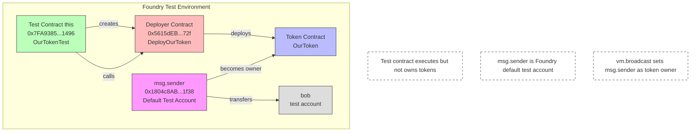

## Foundry

**Foundry is a blazing fast, portable and modular toolkit for Ethereum application development written in Rust.**

Foundry consists of:

-   **Forge**: Ethereum testing framework (like Truffle, Hardhat and DappTools).
-   **Cast**: Swiss army knife for interacting with EVM smart contracts, sending transactions and getting chain data.
-   **Anvil**: Local Ethereum node, akin to Ganache, Hardhat Network.
-   **Chisel**: Fast, utilitarian, and verbose solidity REPL.

## Documentation

https://book.getfoundry.sh/

## Usage

### Build

```shell
$ forge build
```

### Test

```shell
$ forge test
```

### Format

```shell
$ forge fmt
```

### Gas Snapshots

```shell
$ forge snapshot
```

### Anvil

```shell
$ anvil
```

### Deploy

```shell
$ forge script script/Counter.s.sol:CounterScript --rpc-url <your_rpc_url> --private-key <your_private_key>
```

### Cast

```shell
$ cast <subcommand>
```

### Help

```shell
$ forge --help
$ anvil --help
$ cast --help
```

# Address Relationships in Test



关键点说明：
1. `this` (测试合约) 虽然是执行者，但不是代币所有者
2. `msg.sender` 是 Foundry 设置的默认测试账户
3. **`vm.broadcast()` 使得代币所有者变成了 `msg.sender` 而不是测试合约**
4. 部署合约（DeployOurToken）只是一个工具合约，不持有任何代币