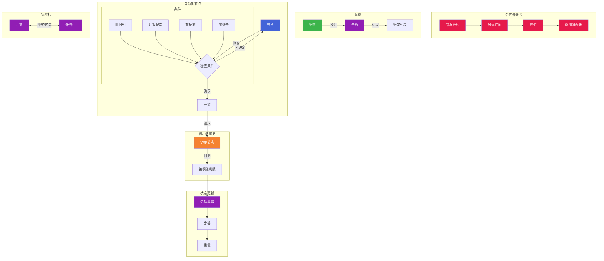

# Proveably Random Raffle Contracts

## About

This code is to create a proveably random smart contract lottery.

## What we want it to do?

1. Users should be able to enter the raffle by paying for a ticket. The ticket fees are going to be the prize the winner receives.
2. The lottery should automatically and programmatically draw a winner after a certain period.
3. Chainlink VRF should generate a provably random number.
4. Chainlink Automation should trigger the lottery draw regularly.

## Workflow

## Contract Addresses

- Sepolia VRF Coordinator: `0x9DdfaCa8183c41ad55329BdeeD9F6A8d53168B1B`
- Sepolia LINK Token: `0x779877A7B0D9E8603169DdbD7836e478b4624789`